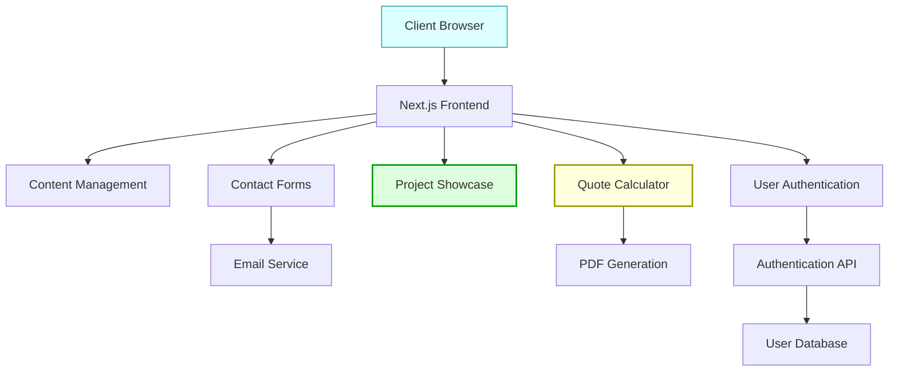
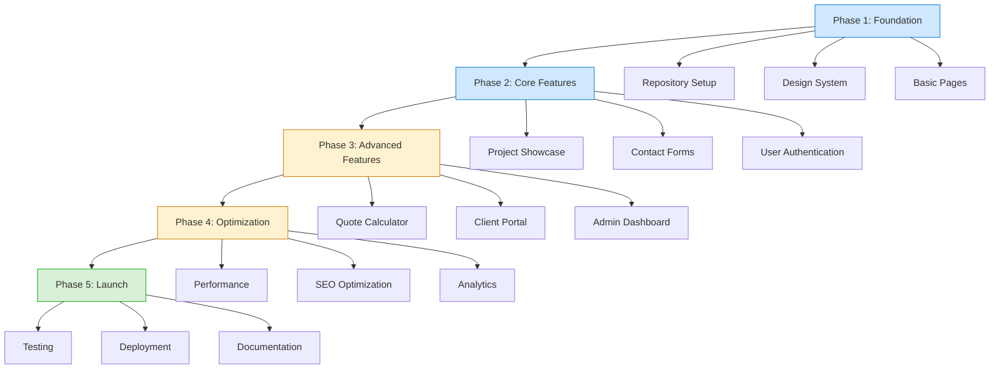

# Contractor Growth Systems - Project Board

## Project Architecture


## 📊 Project Overview



## Current Tasks

- [ ] 1. Phase 1: Foundation
  - [ ] 1a. Set up Next.js project with TypeScript
  - [ ] 1b. Configure Tailwind CSS and Shadcn/UI
  - [ ] 1c. Create component library and design system
  - [ ] 1d. Implement responsive layouts
  - [ ] 1e. Set up CI/CD pipeline

- [ ] 2. Phase 2: Core Features
  - [ ] 2a. Build homepage with hero section
  - [ ] 2b. Create services showcase
  - [ ] 2c. Implement project portfolio with filtering
  - [ ] 2d. Build contact form with validation
  - [ ] 2e. Set up email notification system

- [ ] 3. Phase 3: Advanced Features
  - [ ] 3a. Develop quote calculator
  - [ ] 3b. Implement PDF generation for quotes
  - [ ] 3c. Create user authentication system
  - [ ] 3d. Build client portal for project tracking
  - [ ] 3e. Develop admin dashboard

## Completed Tasks

- [x] 0. Project Initialization
  - [x] 0a. Requirements gathering
  - [x] 0b. Technology selection
  - [x] 0c. Project board setup

## Backlog

- [ ] B1 Implement dark mode
- [ ] B2 Add localization for Spanish-speaking clients
- [ ] B3 Create mobile app version
- [ ] B4 Implement advanced analytics dashboard
- [ ] B5 Add scheduling system for consultations

## AI Recommendations

- [ ] A1 Implement server-side rendering for SEO optimization
- [ ] A2 Add comprehensive error handling and logging
- [ ] A3 Implement progressive web app (PWA) capabilities
- [ ] A4 Set up automated testing with Jest and Cypress
- [ ] A5 Implement rate limiting for API endpoints
- [ ] A6 Use Redis for caching frequently accessed data
- [ ] A7 Implement Content Security Policy (CSP)
- [ ] A8 Add accessibility features (ARIA)
- [ ] A9 Optimize images with WebP format
- [ ] A10 Implement feature flags for gradual rollout

## Development Notes

### Environment Setup
- Node.js v18+
- Next.js 14 with App Router
- TypeScript
- Tailwind CSS
- Shadcn/UI
- Vercel (for deployment)

### API Keys
- Email Service: To be set up
- Authentication Provider: To be set up
- Analytics: To be set up

### Team

- Client: Contractor Growth Systems
- Developer: Full-stack implementation

### Timeline

- Phase 1: 2 weeks
- Phase 2: 3 weeks
- Phase 3: 4 weeks
- Phase 4: 2 weeks
- Phase 5: 1 week

## Daily Log

### April 15, 2024
- Project kickoff meeting
- Requirements gathering completed
- Technology stack finalized

## 🔄 Backlog
- Implement quote calculator validation
- Create project portfolio filters
- Develop testimonials carousel
- Set up Google Analytics
- Add schema markup for SEO

### 🚧 In Progress  
- Setting up Next.js project structure
- Creating initial component library
- Designing homepage mockup

### ✅ Done
- Project requirements document
- Technology selection
- Initial project board setup

## 🔍 Recent Changes
- Created BOARD.md
- Set up dashboard system
- Initialized Next.js project

## 🗺️ Component Structure

```
src/
├── components/
│   ├── ui/            # Shadcn UI components
│   ├── Navbar.tsx     
│   ├── HeroSection.tsx
│   ├── ServicesSection.tsx
│   ├── ProjectsSection.tsx
│   ├── TestimonialsSection.tsx
│   ├── ContactSection.tsx
│   ├── Footer.tsx    
│   ├── QuoteCalculator.tsx
│   └── forms/
│       ├── ContactForm.tsx
│       └── QuoteForm.tsx
├── lib/
│   ├── api.ts
│   ├── utils.ts
│   └── auth.ts
└── pages/
    ├── index.tsx
    ├── services.tsx
    ├── projects.tsx
    ├── about.tsx
    ├── contact.tsx
    ├── quote.tsx
    └── dashboard/
        ├── index.tsx
        ├── projects.tsx
        └── settings.tsx
```

## 🎯 Next Tasks (Prioritized)

1. **Project Setup**
   - [ ] Initialize Next.js with TypeScript
   - [ ] Configure Tailwind CSS and Shadcn UI
   - [ ] Set up linting and formatting
   - [ ] Create initial project structure

2. **Homepage Development**
   - [ ] Create responsive navbar
   - [ ] Implement hero section with CTA
   - [ ] Build services showcase component
   - [ ] Implement testimonials section
   - [ ] Add contact form with validation

3. **Project Portfolio**
   - [ ] Design project card component
   - [ ] Implement filtering system
   - [ ] Create project detail page
   - [ ] Add image gallery with lightbox

4. **Quote Calculator**
   - [ ] Design calculator interface
   - [ ] Implement form validation
   - [ ] Create PDF generation functionality
   - [ ] Set up email delivery system

## 📝 Notes

- Targeting small to medium-sized contractors looking to enhance their online presence
- Focus on mobile-first design as many clients will browse on phones at job sites
- Need to ensure fast load times and optimized images
- Consider implementing client testimonial verification system
- Quote calculator should be user-friendly but provide accurate estimates 
