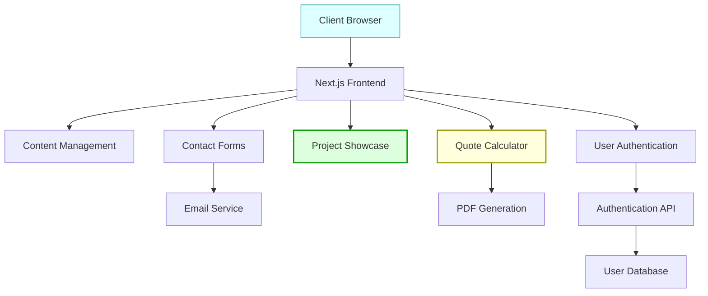
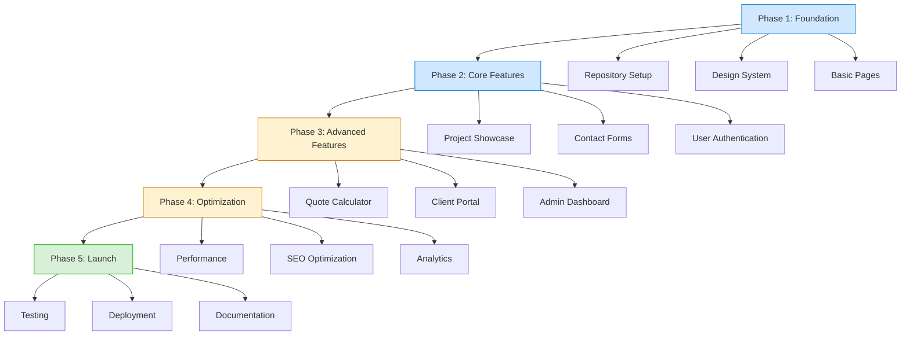

# Contractor Growth Systems - Project Board

## Project Architecture

```mermaid
graph TD
    A[Client Browser] --> B[Next.js Frontend]
    B --> C[Content Management]
    B --> D[User Authentication]
    B --> E[Project Showcase]
    B --> F[Contact Forms]
    B --> G[Quote Calculator]
    F --> H[Email Service]
    G --> I[PDF Generation]
    D --> J[Authentication API]
    J --> K[User Database]
    
    style A fill:#dff,stroke:#099
    style G fill:#ffd,stroke:#990,stroke-width:2px
    style E fill:#dfd,stroke:#090,stroke-width:2px
```

## 📊 Project Overview


```mermaid
graph TD
    M1[Phase 1: Foundation] --> M2[Phase 2: Core Features]
    M2 --> M3[Phase 3: Advanced Features]
    M3 --> M4[Phase 4: Optimization]
    M4 --> M5[Phase 5: Launch]
    
    M1 --> M1A[Repository Setup]
    M1 --> M1B[Design System]
    M1 --> M1C[Basic Pages]
    
    M2 --> M2A[Project Showcase]
    M2 --> M2B[Contact Forms]
    M2 --> M2C[User Authentication]
    
    M3 --> M3A[Quote Calculator]
    M3 --> M3B[Client Portal]
    M3 --> M3C[Admin Dashboard]
    
    M4 --> M4A[Performance]
    M4 --> M4B[SEO Optimization]
    M4 --> M4C[Analytics]
    
    M5 --> M5A[Testing]
    M5 --> M5B[Deployment]
    M5 --> M5C[Documentation]
    
    style M1 fill:#d0e8ff,stroke:#0077cc
    style M2 fill:#d0e8ff,stroke:#0077cc
    style M3 fill:#fff2d0,stroke:#cc7700
    style M4 fill:#fff2d0,stroke:#cc7700
    style M5 fill:#d8f0d8,stroke:#00aa00
```

## Current Tasks

- [ ] 1. Phase 1: Foundation
  - [ ] 1a. Set up Next.js project with TypeScript
  - [ ] 1b. Configure Tailwind CSS and Shadcn/UI
  - [ ] 1c. Create component library and design system
  - [ ] 1d. Implement responsive layouts
  - [ ] 1e. Set up CI/CD pipeline

- [ ] 2. Phase 2: Core Features
  - [ ] 2a. Build homepage with hero section
  - [ ] 2b. Create services showcase
  - [ ] 2c. Implement project portfolio with filtering
  - [ ] 2d. Build contact form with validation
  - [ ] 2e. Set up email notification system

- [ ] 3. Phase 3: Advanced Features
  - [ ] 3a. Develop quote calculator
  - [ ] 3b. Implement PDF generation for quotes
  - [ ] 3c. Create user authentication system
  - [ ] 3d. Build client portal for project tracking
  - [ ] 3e. Develop admin dashboard

- [ ] 4. Phase 4: Optimization & Launch
  - [ ] 4a. Performance Testing & Optimization
  - [ ] 4b. SEO Implementation & Validation
  - [ ] 4c. Setup Analytics
  - [ ] 4d. Final User Acceptance Testing (UAT)
  - [ ] 4e. Deployment to Production
  - [ ] 4f. Create Project Documentation

- [ ] 5. Checkout & Payment System (New Section)
  - [ ] 5a. **Set up Stripe Integration:**
    - [ ] Create Stripe account and obtain API keys (Secret & Publishable).
    - [ ] Install Stripe libraries (`@stripe/stripe-js`, `@stripe/react-stripe-js`).
    - [ ] Create backend endpoint (e.g., serverless function) to handle PaymentIntent creation.
    - [ ] Implement Stripe Elements (`CardElement` or individual elements) on the frontend `Checkout.tsx` page.
    - [ ] Implement frontend logic to call backend, get `clientSecret`, and confirm payment with Stripe.
  - [ ] 5b. **Add Required Customer Information Fields:**
    - [ ] Ensure fields for Name, Address, Phone Number, Company Website (Optional), and Email are present and collected during checkout.
    - [ ] Store necessary customer information securely (Note: Full CC details are handled by Stripe Elements, not stored directly).
  - [ ] 5c. **Display Security Information:**
    - [ ] Add visual cues on the checkout page indicating secure payment (e.g., lock icon, "Processed securely by Stripe" text).
    - [ ] (Optional) Consider embedding a Stripe security badge if available/appropriate.
  - [ ] 5d. **Test Payment Workflow:**
    - [ ] Use Stripe test card numbers to simulate successful payments.
    - [ ] Test error handling for failed payments (e.g., declined card, incorrect CVC).
    - [ ] Verify customer information capture.
    - [ ] Test the upsell checkbox functionality and price calculation.

### Checkout Workflow Overview

```mermaid
graph TD
    A[User Clicks "Sign Up Now"] --> B[Navigate to /checkout];
    B --> C{Checkout Page Loaded};
    C --> D[User Reviews Order (Bootcamp + Bonus)];
    C --> E[User Optionally Adds Upsell (Coaching)];
    D --> F[User Enters Billing & Payment Info (Stripe Elements)];
    E --> F;
    F --> G[User Clicks "Complete Purchase"];
    G --> H{Process Payment via Stripe};
    H -- Success --> I[Show Confirmation / Thank You Page];
    H -- Failure --> J[Show Error Message on Checkout Page];
    I --> K[Trigger Welcome Email & Package Delivery];
    K --> L[Send Login Info for Portal];
    L --> M[User Accesses Courses & Training];
    M --> N[🚀 Make $$ Selling Roof Contracts!];

    style H fill:#f9f,stroke:#333,stroke-width:2px
    style N fill:#cfc,stroke:#333,stroke-width:4px
```

## Completed Tasks

- [x] 0. Project Initialization
  - [x] 0a. Requirements gathering
  - [x] 0b. Technology selection
  - [x] 0c. Project board setup

## Backlog

- [ ] B1 Implement dark mode
- [ ] B2 Add localization for Spanish-speaking clients
- [ ] B3 Create mobile app version
- [ ] B4 Implement advanced analytics dashboard
- [ ] B5 Add scheduling system for consultations

## AI Recommendations

- [ ] A1 Implement server-side rendering for SEO optimization
- [ ] A2 Add comprehensive error handling and logging
- [ ] A3 Implement progressive web app (PWA) capabilities
- [ ] A4 Set up automated testing with Jest and Cypress
- [ ] A5 Implement rate limiting for API endpoints
- [ ] A6 Use Redis for caching frequently accessed data
- [ ] A7 Implement Content Security Policy (CSP)
- [ ] A8 Add accessibility features (ARIA)
- [ ] A9 Optimize images with WebP format
- [ ] A10 Implement feature flags for gradual rollout

## Development Notes

### Environment Setup
- Node.js v18+
- Next.js 14 with App Router
- TypeScript
- Tailwind CSS
- Shadcn/UI
- Vercel (for deployment)

### API Keys
- Email Service: To be set up
- Authentication Provider: To be set up
- Analytics: To be set up

### Team

- Client: Contractor Growth Systems
- Developer: Full-stack implementation

### Timeline

- Phase 1: 2 weeks
- Phase 2: 3 weeks
- Phase 3: 4 weeks
- Phase 4: 2 weeks
- Phase 5: 1 week

## Daily Log

### April 15, 2024
- Project kickoff meeting
- Requirements gathering completed
- Technology stack finalized

## 🔄 Backlog
- Implement quote calculator validation
- Create project portfolio filters
- Develop testimonials carousel
- Set up Google Analytics
- Add schema markup for SEO

### 🚧 In Progress  
- Setting up Next.js project structure
- Creating initial component library
- Designing homepage mockup

### ✅ Done
- Project requirements document
- Technology selection
- Initial project board setup

## 🔍 Recent Changes
- Created BOARD.md
- Set up dashboard system
- Initialized Next.js project

## 🗺️ Component Structure

```
src/
├── components/
│   ├── ui/            # Shadcn UI components
│   ├── Navbar.tsx     
│   ├── HeroSection.tsx
│   ├── ServicesSection.tsx
│   ├── ProjectsSection.tsx
│   ├── TestimonialsSection.tsx
│   ├── ContactSection.tsx
│   ├── Footer.tsx    
│   ├── QuoteCalculator.tsx
│   └── forms/
│       ├── ContactForm.tsx
│       └── QuoteForm.tsx
├── lib/
│   ├── api.ts
│   ├── utils.ts
│   └── auth.ts
└── pages/
    ├── index.tsx
    ├── services.tsx
    ├── projects.tsx
    ├── about.tsx
    ├── contact.tsx
    ├── quote.tsx
    └── dashboard/
        ├── index.tsx
        ├── projects.tsx
        └── settings.tsx
```

## 🎯 Next Tasks (Prioritized)

1. **Project Setup**
   - [ ] Initialize Next.js with TypeScript
   - [ ] Configure Tailwind CSS and Shadcn UI
   - [ ] Set up linting and formatting
   - [ ] Create initial project structure

2. **Homepage Development**
   - [ ] Create responsive navbar
   - [ ] Implement hero section with CTA
   - [ ] Build services showcase component
   - [ ] Implement testimonials section
   - [ ] Add contact form with validation

3. **Project Portfolio**
   - [ ] Design project card component
   - [ ] Implement filtering system
   - [ ] Create project detail page
   - [ ] Add image gallery with lightbox

4. **Quote Calculator**
   - [ ] Design calculator interface
   - [ ] Implement form validation
   - [ ] Create PDF generation functionality
   - [ ] Set up email delivery system

## �� Notes

- Targeting small to medium-sized contractors looking to enhance their online presence
- Focus on mobile-first design as many clients will browse on phones at job sites
- Need to ensure fast load times and optimized images
- Consider implementing client testimonial verification system
- Quote calculator should be user-friendly but provide accurate estimates 
