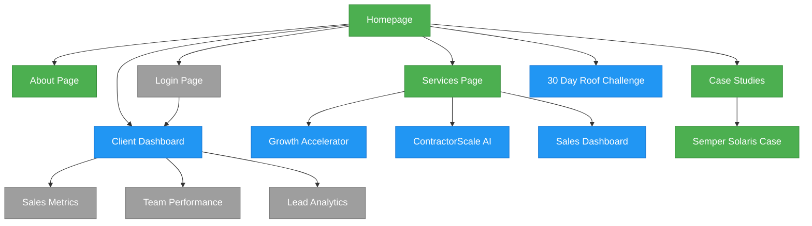

# Contractor Growth Systems Dashboard

## 🔄 Website Flow



## 🤖 AI Recommendations

- [ ] A1: Consider adding testimonial carousel to homepage
- [ ] A2: Review mobile navigation for usability improvements
- [ ] A3: Optimize images for better page loading performance
- [ ] A4: Implement progress tracking for 30 Day Roof Challenge
- [ ] A5: Add social sharing capabilities to case studies

## 📋 Active Tasks

- [ ] 19: Create dashboard for Roof Challenge participants
- [ ] 20: Design email templates for lead nurturing
- [ ] 21: Implement A/B testing for landing pages
- [ ] 22: Set up Google Analytics 4 tracking
- [ ] 23: Create content calendar for blog posts

## 🔄 Backlog

- [ ] B1: Implement blog infrastructure
- [ ] B2: Create content categorization system
- [ ] B3: Develop resource download capabilities
- [ ] B4: Set up newsletter signup integration
- [ ] B5: Implement case study template
- [ ] B6: Develop results visualization components
- [ ] B7: Add testimonials integration
- [ ] B8: Create video testimonial support
- [ ] B9: Implement multi-step interactive quiz
- [ ] B10: Develop PDF report generation for quiz
- [ ] B11: Set up analytics for 30 Day Roof Challenge
- [ ] B12: Create before/after gallery for Roof Challenge results

## ✅ Completed Tasks

- [x] 1: Create repository and set up initial project structure
- [x] 2: Set up CI/CD pipeline for automatic deployment
- [x] 3: Implement responsive design for all pages
- [x] 4: Configure Tailwind and shadcn/ui for styling
- [x] 5: Create navigation and layout components
- [x] 6: Implement basic routing with React Router
- [x] 7: Build homepage with key messaging
- [x] 8: Develop About page with team information
- [x] 9: Create initial services overview page
- [x] 10: Deploy website to production environment

## 🛠️ Environment Setup

- React: Frontend library for building user interfaces
- TypeScript: Typed JavaScript for improved developer experience
- Tailwind CSS: Utility-first CSS framework
- Shadcn/UI: Component library built on Radix UI
- Vite: Build tool and development server
- Node.js: JavaScript runtime for server-side code
- Git: Version control system
- GitHub: Source code hosting and CI/CD integration

## 📝 Significant Changes Log

### 2023-04-01
- Updated dashboard components with real data visualization
- Fixed responsive design issues on mobile devices
- Implemented AI recommendations system
- Initiated 30 Day Roof Challenge landing page project

### 2023-03-31
- Completed Services page with pricing tiers
- Fixed navigation links
- Rebuilt dist folder for deployment
- Updated Home page components

### 2023-03-30
- Implemented Blueprint dashboard component
- Created Sales dashboard visualization
- Added ContractorScale AI tiers description
- Deployed initial version to production

## 📦 Items Needed

- Professional headshots for team section
- Complete case study content for Semper Solaris
- Additional testimonials from clients
- SEO keywords and meta descriptions for all pages
- Logo variations for different backgrounds
- Roof transformation photos for 30 Day Challenge
- Testimonials from previous roof project clients

## ⚠️ Reminders

- Push changes to GitHub after major updates:
  ```bash
  git add .
  git commit -m "Description of changes"
  git push origin main
  ```
- Run builds and check for errors before deployment
- Test all links and forms before pushing to production
- Update the changelog with significant changes
- Review responsive design on mobile, tablet, and desktop 